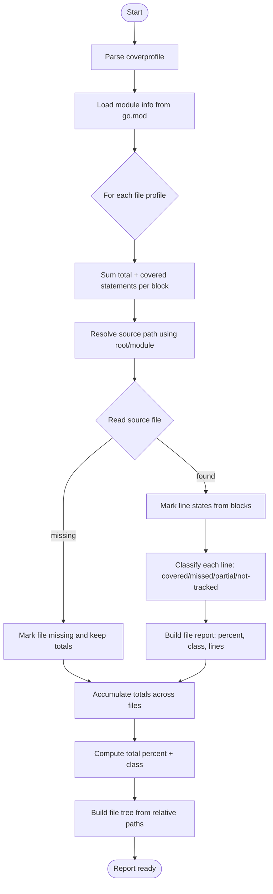

# Beautiful Go Coverage

Generate a modern HTML coverage report directly from a Go coverprofile without converting the `go tool cover` output. The report is emitted as a single, self-contained HTML file with embedded styles and scripts.

Inspired by `https://github.com/gha-common/go-beautiful-html-coverage`.

## Usage

1. Generate a coverprofile:

```bash
go test ./... -coverprofile=coverage.out
```

2. Create the HTML report:

```bash
go run ./cmd/beautiful-coverage -out coverage.html
```

## Flags

- `-profile`: path to the coverprofile file (default `coverage.out`).
- `-out`: output HTML file (default `coverage.html`).
- `-root`: root directory used to resolve source file paths (default: profile directory).
- `-title`: report title (default `Go Coverage Report`).

## Coverage Algorithm


